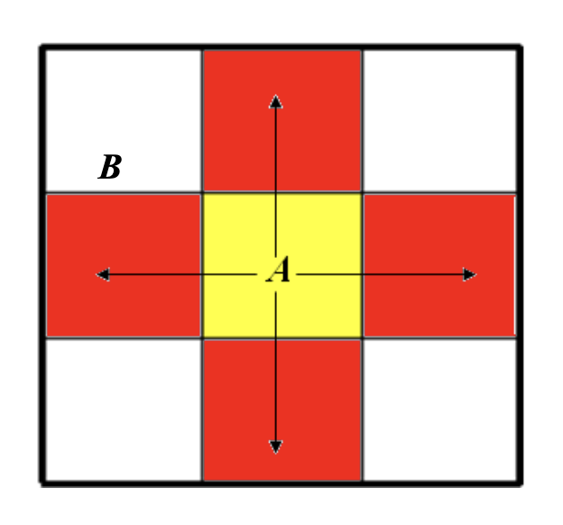
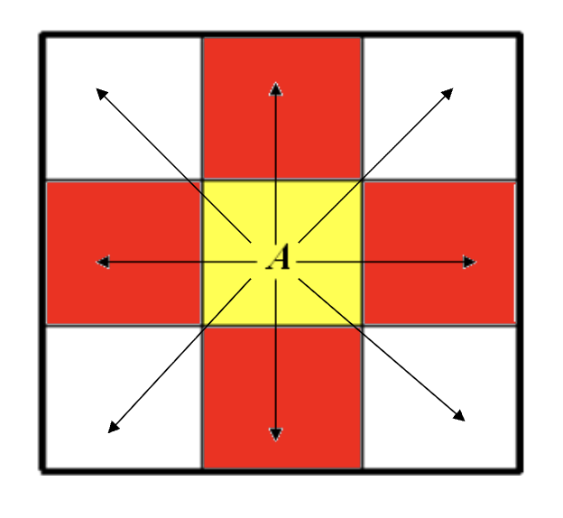
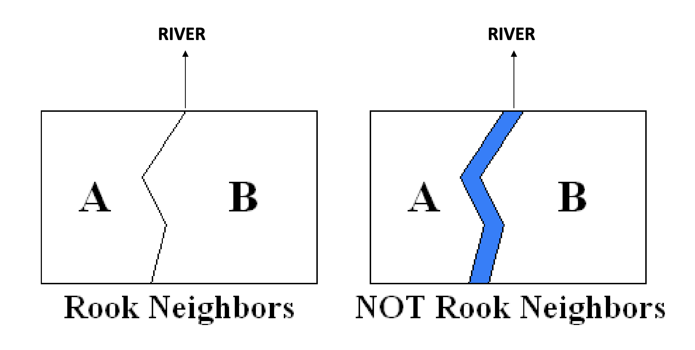

## Spatial Autocorrelation 

Similar to correlation, but

- Instead of examining the association between two variables, we look at the relationship of values within a single variable at nearby locations

- Positive SA if observations that are closer oto eachother in space have related values

- Negative SA if observations close to eachother have markedly different values

### How is spatial proximity defined? 

First, assume that we're dealing with areal data (polygons)

- We can use the methods for point data as well, but contiguity-based measures of proximity don't apply in these instances

For each polygon, we need to identify its spatial relationship with all the other polygons

Distance-based measures of proximity:

- Are polygon centroids within a certain distance to each other?

Contiguity-based measures of proximity

- Do polygons share a boundary with each other?

### Rook neighbor

If two polygons share a segment of a boundary, they are considered rook neighbors. Think of the Rook in chess.

{width="372"}

### Queen neighbors 

If two polygons share a segment OR a vertex of a boundary, they are considered queen neighbors. Think of the Queen in chess.

{width="372"}

### Problems with queen/rook contiguity 

On some maps, a river may appear, but on some maps it won't! This may affect our neighborhood analysis.

## Weights matrices 

For each observation in our data, we want to create a matrix of all of its neighbors.

When we have $n$ observations, we form an $n \times n$ matrix (called a weight matrix or a link matrix) which summarizes all the pairwise spatial relationships in the dataset.

These weight matrices are used in the estimation of spatial regression (and the calculation of spatial autocorrelation indices)

**Note that the spatial weights matrix is symmetric**. If A is a neighbor of B, then B will be a neighbor of A.

Type of weights matrices:

- **Contiguity-based:** based on queen or rook contiguity

- **Distance-based:** based on distance between points or polygon centroids

- $k$**-nearest neighbors:** based on the $k$ nearest neighbors of an observation. This will NOT be symmetric!

It's important to take into account our spatial data. For example, contiguity-based won't be appropriate for island archipelagos like Indonesia. It's a good idea to try different matrices on your data.
