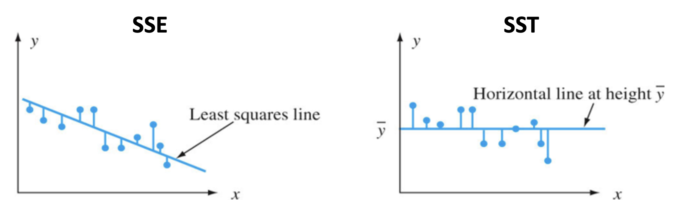

## Review from Lecture 3

If we have a situation where $r=18$ and $p=0.03$, we can say that if $H_0$ where $\rho=0$ is true, then we will observe $r=18$ 3% of the time. The $p$-value tells us how likely are we to get a value that is as extreme or more extreme than the observed one, given $H_0$ is true.

Since $p<0.05$, we can reject $H_0$.

#### Spearman Correlation Coefficient

A Spearman correlation coefficient works if you suspect the variables are not normally distributed or not linear, for example.

Remember that Spearman correlations are simply Pearson correlations between ranked value of $x$'s and $y$'s. Thus, hypothesis tests will be essentially the same as hypothesis tests for Pearson's $r$.

#### Sample sizes

If we have very large samples, even very small correlation coefficients may be statistically significant. Inversely, if we have very small sample sizes, even very large correlation coefficients may be statistically significant.

Remember, the $T$-distribution largely depends on its $n-1$ degrees of freedom.

## Ordinary Least Squares Regression

A statistical method used to examine the relationship between a variable of interest (dependent variable) and **one or more** explanatory variables (predictors)

- Strength of the relationship

- Direction of the relationship (positive, negative, zero)

- Goodness of model fit

OLS regression allows you to calculate the amount by which your dependent variable changes when a predictor variable changes by one unit (holding all other predictors constant)

Regression with one predictor is called **simple regression**

Regression with two+ predictors is called **multiple regression**.

#### Variable relationships

Two variables, $x$ and $y$, can be related to each other in two ways:

- In a Deterministic relationship, i.e. $y$ is some mathematical function of $x$ (e.g. $y=\text{log}(x+8)$, $y=x^2$, $y=4x+8$, etc.)

- In a Non-Deterministic relationship, i.e. there is some general relationship between $x$ and $y$, by no formula that will enable you to calculate the precise value of $y$ for $x$.

  - SAT scores and college GPA

  - Crime rate and household income

  - Temperature in a room and comfort level

#### The simplest deterministic relationship

The simplest deterministic mathematical relationship between two variables $x$ and $y$ is a linear relationship $y=mx+b$, which statisticians rewrite as $y=\beta_0+\beta_1 x$.

The set of pairs $(x,y)$ for which the relationship determines a straight line with slope $\beta_1$ and y-intercept $\beta_0$

#### The linear probabilistic model

For the deterministic model $y=\beta_0 + \beta_1 x$, the actual observed value of $y$ is a linear function $x$. In a probabilistic model, we assume $\mathbb{E}(y)$ is a linear function of $x$, but for fixed $x$, the variable $y$ differs from $\mathbb{E}(y)$ by a random amount $\epsilon$.

#### The residual term $\epsilon$

The variable $\epsilon$ is usually referred to as the **residual** or **random error** term in the model

- Without $\epsilon$, any observed pair $(x,y)$ would fall exactly on the line $y=\beta_0 + \beta_1 x$ called the **true** (or **population**) **regression line**.

The inclusion of $\epsilon$ allows $(x,y)$ to fall either above the true regression line (when $\epsilon>0$ or below the line (when $\epsilon<0$).

## The Simple Linear Regression Model

There are parameters $\beta_0$, $\beta_1$, and $\sigma^2$ such that for any fixed value of the independent variable $x$, the dependent variable $y$ is related to $x$ through the model equation:

$$y = \beta_0 + \beta_1 x_1 + \beta_2 x_2 + \dots + \beta_n x_n + \epsilon$$

Here, the quantity $\epsilon$ is a random variable, which we call the residual, and which is assumed to be normally distributed, with $\mathbb{E}(\epsilon)=0$ and $V(\epsilon)=\sigma^2$. Said differently, $\epsilon \sim \mathcal{N}(0, \sigma^2)$.

#### Implications of the Simple Regression Model

The mean value of $y$ is a linear function of $x$.

- That is, the true regression line is the line of mean values.

- The $y$ value on the line at any $x$ is $\mathbb{E}(y)$ at that $x$.

#### Least Squares Estimation

The way we calculate values for $\beta_1$ and $\beta_0$ involves minimizing the sum of **squared vertical distances** between the points and the estimated regression line.

The least squares estimate of the slope coefficient $\beta_i$ of the true regression line can be represented as:

$$ \beta_1 = \frac{n\sum x_i y_i - \sum x_i \sum y_i}{n\sum x_i^2 - \left(\sum x_i\right)^2}$$

#### Estimating $\sigma^2$

The parameter $\sigma^2$ determines the amount of variability inherent in the regression model.

- If $\sigma^2$ is small, the pairs $(x_i, y_i)$ will fall very close to the the true line.

- If $\sigma^2$ is large, the pairs $(x_i, y_i)$ will be quite spread out about the true regression line.

#### Sum of Squared Errors (SSE)

The SSE is the quantity that the least squares method attempts to minimize. It measures the Its formula is:

$$\text{SSE}=\sum (y_i-\hat{y_i})^2$$

A lower SSE means your model's predictions are very close to the actual data points, indicating a good fit.

#### Total Sum of Squares (SST)

A quantitative measure of the total amount of variation in observed $y$ values is given by the **total sum of squares (SST)**:

$$\text{SST}=\sum(y_i-\bar{y})^2$$

The SST is the sum of squared deviations about the sample mean of the observed $y$ values – without regard to $x$.



#### The Coefficient of Determination

If SSE is the amount of variance in $y$ unexplained by the regression model and SST is the total amount of variance in $y$, then SSE/SST is the **proportion** of total variance that is unexplained by the model.

Then:

$$1-\text{SSE/SST} = \text{SSR/SST} = R^2$$

$R^2$ is called the coefficient of determination. It is the proportion of the observed variation in the dependent variable $y$ that was **explained** by the model. Here, SSR is the **regression sum of squares**, and is calculated as $\text{SSR=SST-SSE}$.

The higher the value of $R^2$, the more successful the simple linear regression model is in explaining the variation in dependent variable $y$. If $R^2$ is small, then you would usually want to look for another model, which either includes alternative, additional, or transformed predictors.

Note that $R^2$ is the square of $r$, Pearson's correlation coefficient!

## Basic Regression in R

#### Setting up data

```{r}
hours_studied <- c(1, 2, 3, 4, 5, 6, 7, 8, 9, 10)
exam_score <- c(52, 55, 61, 63, 68, 72, 75, 81, 85, 90)

data <- data.frame(hours_studied, exam_score)
data
```

#### Visualizing the relationship

```{r}
plot(data$hours_studied, data$exam_score,
     main = 'Hours Studied vs Exam Score',
     xlab = 'Hours Studied',
     ylab = 'Exam Score',
     pch = 19, 
     col = 'blue')
```

#### Fitting the linear model

```{r}
model <- lm(exam_score ~ hours_studied, data=data)
summary(model)
```

#### Adding regression line to the plot

```{r}
plot(data$hours_studied, data$exam_score,
     main='Hours Studied vs Exam Score',
     xlab='Hours Studied',
     ylab='Exam Score',
     pch=19,
     col='blue')
abline(model, col='red', lwd=2)
```

#### Basic predictions

```{r}
new_data <- data.frame(hours_studied = 5.5)
predict(model, newdata = new_data)
```
