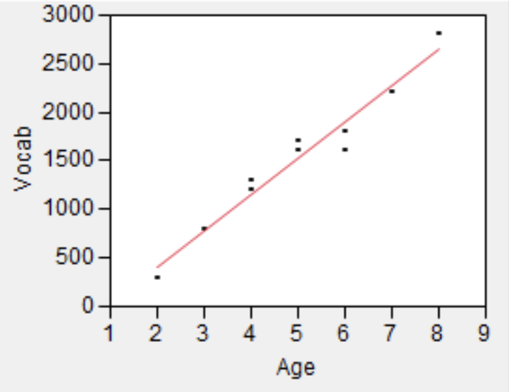
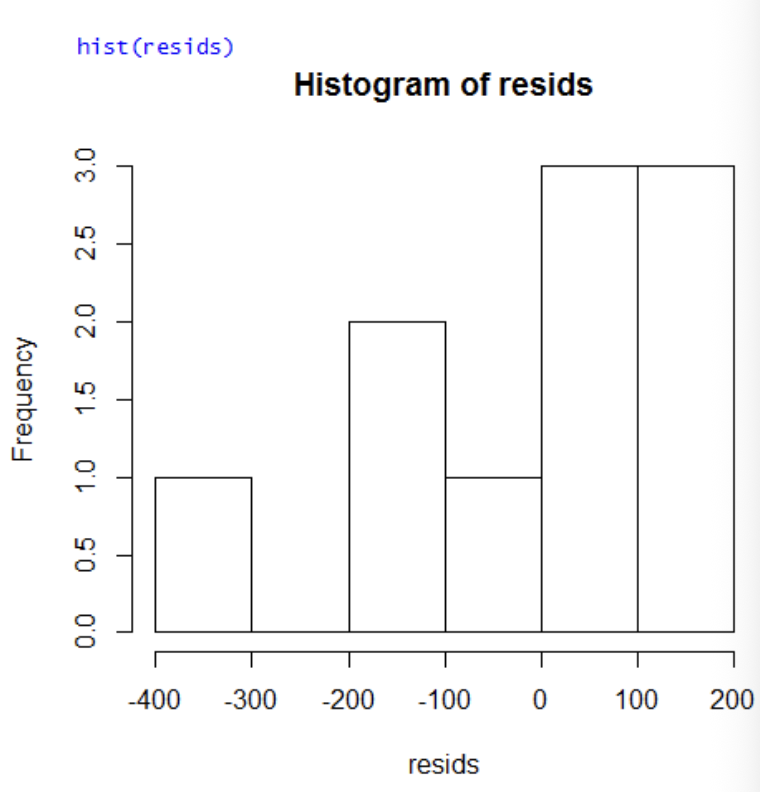
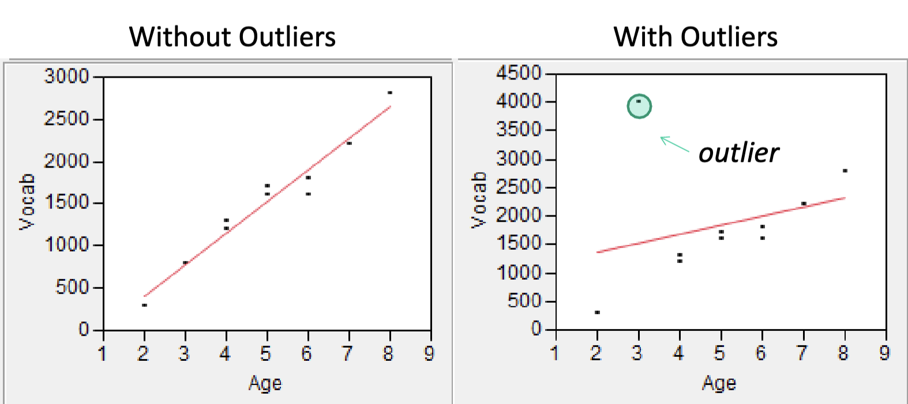
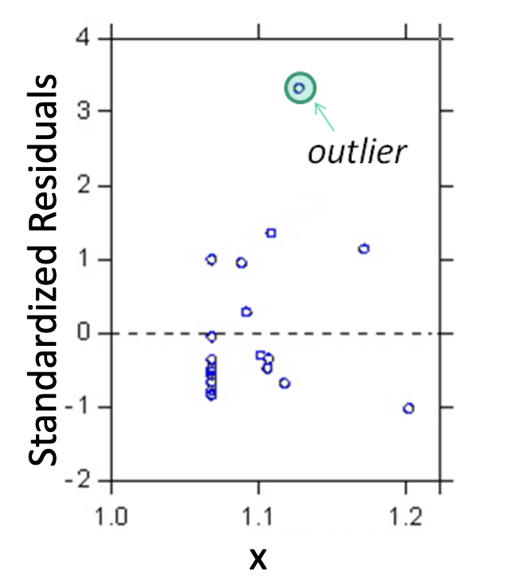
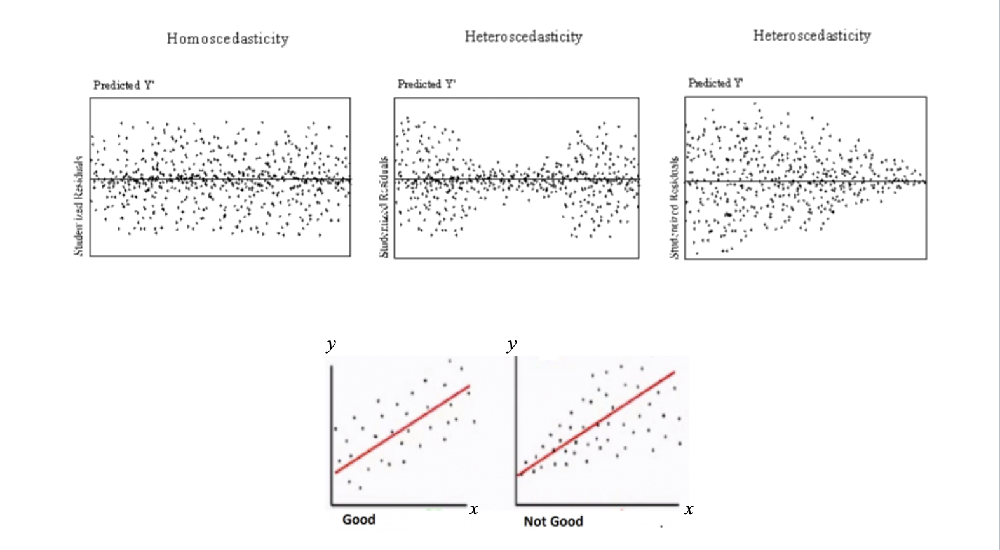

## Inferences about the Slope Parameter $\beta_1$

The slope $\beta_1$ of the population regression line is the true average in the dependent variable $y$ associated with a 1-unit increase in the predictor $x$.

Calculated from sample data, the slope of the least squares regression line, $\hat{\beta}_1$, gives a point estimate of $\beta_1$.

Because $\hat{\beta}_1$ varies from sample to sample, it is a random variable.

$\hat{\beta}_1$ has a sampling distribution with mean $\mathbb{E}(\hat{\beta}_1)$ and variance $V(\hat{\beta}_1)$.

$$\mathbb{E}(\hat{\beta_1}) = \beta_1 $$

This is just like how $\mathbb{E}(\bar{X})=\mu$.

### Standardizing $\hat{\beta}_1$

We can standardize $\hat{\beta}_1$ by subtracting its mean and dividing the difference by the standard deviation $S$.

$$\frac{\hat{\beta}_1-\mathbb{E}(\hat{\beta}_1)}{S(\hat{\beta}_1)}=\frac{\hat{\beta}_1-\beta_1}{S/\sqrt{\sum(x_i-\bar{x})^2}} = \frac{\hat{\beta}_1-\beta_1}{S_{\hat{\beta}_1}}=T$$

Here, $T$ has a $t$ distribution with $n-2$ degrees of freedom.

### Hypothesis Tests

We can do a hypothesis test about the parameter $\beta_1$:

$$H_0:\beta_1=0$$

$$H_1: \beta_1 \ne 0$$

As always, the interval is centered at the point estimate of the parameter, and the amount it extends out to each side of the estimate depends on the desired confidence level (through the $t$ critical value) and on the amount of variability in $\hat{\beta}_1$.

## Model Assumptions: Simple Linear Regression

1.  There is a linear relationship between $y$ and $x$
2.  Residuals are normally distributed
3.  Residuals are random
4.  Residuals are homoscedastic
5.  Independence of observations and residuals
6.  $y$ is continuous and preferably normal

### Linearity

Is the linear regression model appropriate? Create a scatter plot of $x$ and $y$ to see whether the relationship is indeed *linear*

- If the relationship is not linear, variable transformation or polynomial regression might be better.

{width="319"}

### Normality of residuals

Normality of residuals is important for point estimation, confidence intervals, and hypothesis tests only for small samples due to the CLT.

If there are more than 30+ observations with 10 additional observations for every predictor after the first one, do not worry about normality.

In order to predict future values of $y$, normality is **essential** for all sample sizes

Variable transformations can sometimes be used to correct for normality.

{width="334"}

Violations in the normality of residuals might arise either because:

- the dependent variable and/or independent variables themselves are non-normal

- the linearity assumption is violated

### Outliers

The values of $\hat{\beta}_1$ and $\hat{\beta}_0$ will change in the presence of outliers, and this will affect predicted values $\hat{y}_i$ for all observations $i$.

- Outliers influence regression fir more so than other observations

- Observations have $y$ values that are 3+ standard deviations away from the expected value of $y$ for the particular value of $x$

- Sometimes outliers are simply data errors (ex. data entry mistakes). A way to deal with them is to run the model with and without them, and present the results.

### Standardizing residuals

Standardizing residuals makes it easier to spot outliers by putting everything on a common scale. Simply put, it's residuals divided by their standard error:

$$e^*_i \approx \frac{\epsilon_i}{s}\approx \frac{\epsilon_i}{\sqrt{SSE/(n-2)}}$$

If a particular standardized residual is 2, then the residual itself is 2 standard deviations larger than what would be expected from fitting the "correct" model.

The standardized residual plot is also good at detecting outliers in data:

{width="281"}

### Things to watch out for

There should be no relationship between random residuals and $x$. This is called **heteroscedasticity** and violates a key assumption of simple OLS regression.

In order to achieve **homoscedasticity**, the residual plot should look completely random with no pattern.

### Time and space dependence

If your data has a temporal or spatial component, then residuals of observations that are close to each other (either in time or space) will likely be similar (i.e., autocorrelated).

**In these cases, we need to use time series or spatial regression.**

### Omitted predictors

It could also be the case that there is a predictor that has been omitted from the model – one that is both correlated with $x$ and a determinant of $y$.

## Centering the predictor

In theory, centering the predictor can be useful if you want the y-intercept to have an interpretable value. Basically it shifts the graph to the left so $\beta_0$ changes. **In practice, we rarely look at** $\beta_0$ **anyway.**
