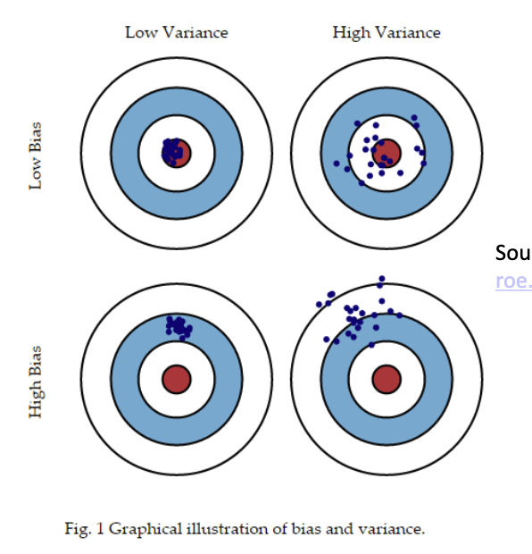
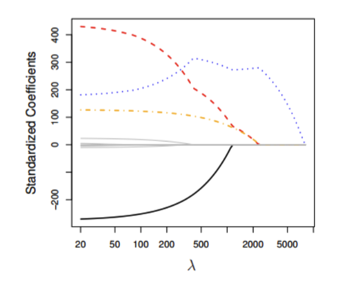

## Stepwise Regression: Automatic Predictor Selection

Simple data mining method which selects predictors based on some criteria

- $p$-values below a certain threshold (ex. only include variables where $p$-values $<0.01$)

- Smallest value of the Akaike Information Criterion (AIC), a measure of relative quality of statistical models

There are a number of problems with it:

- The final model is not guaranteed to be optimal in any specified sense

- The procedure yields a single final model, although there are often several equally good models

- Stepwise regression does not take into account a researcher's knowledge about the predictors, it may be necessary to force the procedure to include more important predictors.

- We should not jump to the conclusion that all the important predictor variables for predicting $y$ have been identified, or that all the unimportant predictor variables have been eliminated. It is possible that we may have committed a Type I or Type II error.

- Many $t$-tests testing $\beta_k=0$ are conducted in a stepwise regression procedure. The probability is therefore high that we included some unimportant predictors or excluded some important predictors.

### In R:

```{r}
library(MASS)
mydata = read.csv('RegressionData.csv')
fit <- lm(MEDHVAL ~ PCTBACHMOR + PCTVACANT + MEDHHINC + PCTSINGLES, data=mydata)
step <- stepAIC(fit, direction='both')
```

## Some issues with OLS regression

- The \# of observations has to be larger than the \# of predictors

  - In practice, in OLS regression we should have at the very least 10 observations per predictor

  - Probability of type II error (incorrectly failing to reject $H_0$) decreases as the number of observations per predictor increases

- Multicollinearity

  - If the predictors are strongly correlated, the OLS $\beta$ coefficient estimates have large variances, and they may be far from the true value

- Overfitting

  - The way OLS regression parameters are estimated, we will always have some estimate for the coefficients of every predictor and they will often be non-zero, even though some of these predictors may not be truly related to the dependent variable.

  - These non-zero parameter estimates may not make much sense when fitting the same model to a different dataset

## Ridge Regression

Ridge regression offers a solution to these issues. In particular, it:

- Allows for a large \# of predictors relative to the \# of observations

- Allows for multicollinearity

- Deals with overfitting by shrinking the coefficients of variables towards 0

- Instead of minimizing the $\text{SSE}$, it minimizes the $\text{SSE}$ subject to a bound (a constraint) on the quantity called $L_2\text{norm}$, which is simply the square root fo the sum of all squared $\beta$ coefficients.

  $$
  L_2\text{norm}=\Vert \boldsymbol{\beta} \Vert_2 = \sqrt{\sum_{i=1}^{k} \beta_i^2}
  $$

Recall that OLS regression finds $\hat{\beta_i}$ that minimize the sum of squared errors, where $\text{SSE}=\sum\epsilon^2$.

**Ridge regression** finds $\hat{\beta^R_i}$ that minimizes the quantity below:

$$
\text{SSE} + \lambda(\hat{\beta}_1^2+\hat{\beta}_2^2 + \dots + \hat{\beta}_k^2)
$$

Here, $\lambda\ge0$ is called the **tuning parameter**.

### The shrinkage penalty

$\lambda$ is called the tuning parameter which controls the relative impact of $\text{SSE}$ and the shrinkage pentalty on the regression coefficient estimates.

When $\lambda=0$, the shrinkage penalty term has no effect, and you get plain OLS.

As $\lambda \to \infty$, the impact of the shrinkage penalty grows, and the ridge regression coefficient estimates $\hat{\beta_i}$ will approach 0, making the model smaller

### The intercept term

Note that $\hat{\beta}_0$ is not part of the shrinkage penalty. We do not want to shrink the intercept, which is simply a measure of the mean value of $y$ when all predictors are equal to 0.

### Standardizing predictors

For ridge regression, we standardize predictors.

For each predictor $x$, compute the mean $\bar{x}$ and standard deviation $s_x$. Then, take the original value of the predictor, subtract it from $\bar{x}$, and divide the difference by $s_x$.\

This way, each standardized predictor will have a mean of 0 and a standard deviation of 1 prior to running the regression.

## Bias and Variance

### Bias of an estimator

Bias of an estimator is the difference between the expected value of the estimator and the true value of the parameter.

For example, $\bar{X}$ is a point estimator of population mean $\mu$. The bias of estimator $\bar{X}$ is the difference between $\mathbb{E}(\bar{X})$ and $\mu$. However, because $\mathbb{E}(\bar{X}) = \mu$, the difference is 0, and $\bar{X}$ is an **unbiased** estimator of $\mu$.

Similarly with OLS regression, $\mathbb{E}(\hat{\beta}_i)=\beta_i$.

Therefore, **bias** refers to the error that is introduced by approximating a real-life problem, which may be extremely complicated, by a much simpler model. Linear regression assumes that there is a linear relationship between the independent variable in predictors. In real life, it is highly unlikely that there is such a simple linear relationship so there will absolutely be some bias in the estimate of $\hat{y}$.

### Variance of an Estimator

If a variable is normal, both the sample mean $\bar{X}$ and the sample median $\tilde{X}$ are unbiased estimators of the population mean $\mu$.

Traditionally, statisticians have preferred unbiased estimators with the smallest variance.

In the context of regression analysis, variance is the amount $\hat{y}$ would change if we estimated it using a different training data set.

{width="353"}

### MSE: A function of bias and variance

The MSE (and consequently the RMSE) in the validation data is a function of both bias and variance.

In order to minimize the MSE in unseen data, we need to select a model that simultaneously achieves low variance and low bias.

OLS seems to be a good model because it yields unbiased estimates of $\hat{y}$ with the smallest variance. But even though OLS estimators are unbiased, they still have higher variance than some biased estimators.

- Ridge regression predictions $\hat{y}$ are biased, but have lower variance than OLS predictions for certain values of $\lambda$.

A visualization:

```{r}
#| echo: false
library(ggplot2)
library(MASS)   # for mvrnorm

set.seed(1)

# ---- Simulation setup ----
n      <- 50      # training observations
p      <- 30      # predictors (correlated -> OLS has high variance)
sigma  <- 3       # noise SD
nsim   <- 500     # number of simulated training sets
ntest  <- 200     # test points

Sigma  <- 0.6^abs(outer(1:p, 1:p, "-"))          # AR(1) correlation
beta   <- rnorm(p, 0, 1)                          # true coefficients
X      <- mvrnorm(n, rep(0, p), Sigma)            # fixed training design
Xtest  <- mvrnorm(ntest, rep(0, p), Sigma)        # fixed test design
f_test <- as.vector(Xtest %*% beta)               # true mean at test points

lambdas <- seq(0, 100, by = 1)

# Many training responses from the same X, with fresh noise each time
Y   <- as.vector(X %*% beta) + matrix(rnorm(n * nsim, 0, sigma), n, nsim)
XtX <- crossprod(X)
XtY <- crossprod(X, Y)

# ---- Compute bias^2, variance, MSE for each lambda ----
res <- lapply(lambdas, function(lam) {
  B <- solve(XtX + lam * diag(p), XtY)            # p x nsim ridge coefficients
  P <- Xtest %*% B                                # ntest x nsim predictions
  bias2    <- mean((rowMeans(P) - f_test)^2)
  variance <- mean(apply(P, 1, var))
  data.frame(lambda = lam,
             bias2 = bias2,
             variance = variance,
             mse = bias2 + variance + sigma^2)    # + irreducible noise
})
res <- do.call(rbind, res)

best <- res[which.min(res$mse), ]

# ---- Plot ----
long <- rbind(
  data.frame(lambda = res$lambda, value = res$mse,      curve = "Validation MSE"),
  data.frame(lambda = res$lambda, value = res$bias2,    curve = "Squared bias"),
  data.frame(lambda = res$lambda, value = res$variance, curve = "Variance")
)

ggplot(long, aes(lambda, value, color = curve)) +
  geom_line(linewidth = 1.1) +
  geom_point(data = best, aes(lambda, mse),
             inherit.aes = FALSE, shape = 4, size = 5, stroke = 1.8,
             color = "purple") +
  scale_color_manual(values = c("Validation MSE" = "red",
                                "Squared bias"   = "black",
                                "Variance"       = "darkgreen")) +
  labs(x = expression(lambda), y = NULL, color = NULL,
       title = "Ridge regression: bias-variance trade-off",
       subtitle = paste0("Minimum validation MSE at lambda = ", best$lambda)) +
  theme_minimal(base_size = 14) +
  theme(legend.position = "bottom")
```

We can see as $\lambda$ gets larger, variance shrinks but MSE and bias grows. The trade-off benefit is better predictions on new data.

### OLS vs Ridge

+--------------------------------------------------------------------------------------------------------+--------------------------------------------------+
| OLS wins                                                                                               | Ridge wins                                       |
+========================================================================================================+==================================================+
| Lots of data, few features                                                                             | You want to predict new data                     |
|                                                                                                        |                                                  |
| Care about unbiased coefficient estimates or classical inference (SE, confidence intervals, p-values)  | Features are highly correlated                   |
|                                                                                                        |                                                  |
| Care about interpretability                                                                            | You have many features relative to observations  |
|                                                                                                        |                                                  |
|                                                                                                        | OLS fit is noisy or unstable                     |
+--------------------------------------------------------------------------------------------------------+--------------------------------------------------+

### Ridge regression interpretation 

We can show that ridge regression doesn't set coefficients exactly to zero unless $\lambda = \infty$, in which case they're all 0. While ridge regression performs well in terms of prediction accuracy, it does poorly in terms of offering a clear interpretation.

Because ridge regression modifies the coefficients, it's pretty difficult to interpret and get significance from them.

In summary:

- We select the value of $\lambda$ which yields the lowest MSE on unseen data

- For that optimal value of $\lambda$, look at the plots of coefficients against $\lambda$ to figure out which variables have the greatest predictive power

An important limitation is that ridge regression is it will include all $k$ predictors in the final model (unlike the stepwise linear regression that we saw before).

## Lasso Regression 

Lasso is like ridge, but it can set the values of certain coefficients to exactly 0 for different values of $\lambda$ and therefore exclude them. It stands for Least Absolute Shrinkage and Selection Operator.

Lasso regression finds $\hat{\beta}^L_i$ that minimizes the quantity below:

$$
\text{SSE} + \lambda(\vert\hat{\beta}_1^2\vert+\vert\hat{\beta}_2^2\vert + \dots + \vert\hat{\beta}_k^2\vert)
$$

Like with ridge, when $\lambda=0$, we get OLS estimates. As $\lambda$ increases, the amount of non-zero standardized coefficients decreases:

{width="362"}

Like with ridge regression, we are able to see which predictors have the largest effect on the dependent variable by looking at the magnitude of the coefficients for different levels of $\lambda$, especially the value that yields the lowest MSE on unseen data.

There are issues with interpreting the coefficients of lasso regression due to bias (unlike with OLS).

In summary:

- We select the value of $\lambda$ which yields the lowest MSE on unseen data

- For the optimal value of $\lambda$, we will look at the plots of coefficients against $\lambda$ to figure out which variables have the greatest predictive power.

## Comparing Ridge and Lasso regression 

Lasso regression has a major advantage over ridge, in that it is able to produce simpler and more interpretable models that involve only a subset of the predictors. However, one is not inherently better than the other.

Lasso will perform better where a relatively small \# of predictors have substantial coefficients, and the remaining predictors have coefficients that are very small or equal zero

## Example in R 

```{r}
library(ISLR)
library(glmnet)
options(scipen=999)

head(Hitters)
dim(Hitters)
```

```{r}
Hitters = na.omit(Hitters)
dim(Hitters)
```

```{r}
x=model.matrix(Salary~.,Hitters)[,-1]
y = Hitters$Salary
```

Preparing values of lambda:

```{r}
grid <- 10^seq(10, -2, length = 100)

df <- data.frame(index = 1:100, lambda = grid)

ggplot(df, aes(x = index, y = lambda)) +
  geom_point() + theme_minimal()
```

### Ridge regression 

```{r}
ridge.mod=glmnet(x,y,alpha=0,lambda=grid)
```

Looking at the definitions of the coefficient matrix, there will be 20 rows (19 predictors and one intercept term) and 100 values of lambda.

```{r}
dim(coef(ridge.mod))
```

```{r}
cbind(ridge.mod$lambda[1], ridge.mod$lambda[50], ridge.mod$lambda[100])
cbind(coef(ridge.mod)[,1], coef(ridge.mod)[,50], coef(ridge.mod)[,100])
```

```{r}
mean(y)
```

### Training and validation 

```{r}
set.seed(1)
train=sample(1:nrow(x), nrow(x)/2)
test = (-train)
```

Next, we will fit a ridge regression model on the training set, and evaluate its MSE on the test set using $\lambda=4$.

```{r}
y.test = y[test]
```

```{r}
ridge.mod = glmnet(x[train,], y[train], alpha=0, lambda=grid, thresh=1e-12)
```

What do we get when lambda is 4?

```{r}
ridge.pred = predict(ridge.mod, s=4, newx=x[test,])
head(ridge.pred)
```

```{r}
test.mse=mean((ridge.pred-y.test)^2)
print(test.mse)
test.rmse = sqrt(test.mse)
print(test.rmse)
```

What if we choose a value of a very large lambda?

```{r}
ridge.pred=predict(ridge.mod, s=1e10, newx=x[test,])
head(ridge.pred)
```

```{r}
test.mse=mean((ridge.pred-y.test)^2)
test.mse
test.rmse = sqrt(test.mse)
test.rmse
```

What about when lambda = 0, getting OLS estimates?

```{r}
ridge.pred = predict(ridge.mod, s=0, newx=x[test,])
```

```{r}
test.mse=mean((ridge.pred-y.test)^2)
test.mse
test.rmse = sqrt(test.mse)
test.rmse
```

How do we choose the best one? There's a cross-validation (CV) method for this:

```{r}
set.seed(1)
cv.out=cv.glmnet(x[train,], y[train], alpha=0, nfolds=10)
```

```{r}
plot(cv.out)
```

```{r}
bestlam = cv.out$lambda.min
bestlam
```

Now let's use this best lambda!

```{r}
ridge.pred = predict(ridge.mod, s=bestlam, newx=x[test,])
mse.bestlam <- mean((ridge.pred-y.test)^2)
rmse.bestlam <- sqrt(mse.bestlam)
mse.bestlam
rmse.bestlam
```

### Lasso Regression

`alpha=1` signifies that we're doing lasso, not ridge.

```{r}
lasso.mod = glmnet(x[train,],y[train],alpha=1,lambda=grid)
```

```{r}
set.seed(1)
cv.out=cv.glmnet(x[train,],y[train],alpha=1)
plot(cv.out)
```

```{r}
bestlam = cv.out$lambda.min
bestlam
```

```{r}
lasso.pred = predict(lasso.mod, s=bestlam, newx=x[test,])
mse.bestlam.lasso <- mean((lasso.pred-y.test)^2)
rmse.bestlam.lasso <- sqrt(mse.bestlam.lasso)
mse.bestlam.lasso
rmse.bestlam.lasso
```

Here, we can see that Lasso has a substantial advantage over ridge, in that the resulting coefficient estimates are sparse.

```{r}
out=glmnet(x,y,alpha=1,lambda=grid)
lasso.coef=predict(out,type="coefficients",s=bestlam)[1:20,]
lasso.coef
```

```{r}
lasso.coef[lasso.coef!=0]
```

What if we just did OLS (lambda=0)?

```{r}
lasso.lm = lm(y~Hitters$AtBat + Hitters$Hits + Hitters$Walks + Hitters$Years + Hitters$CHmRun + Hitters$CRuns + Hitters$CRBI + Hitters$League + Hitters$Division + Hitters$PutOuts + Hitters$Errors)
summary(lasso.lm)
```

```{r}
library(car)
vif(lasso.lm)
```
